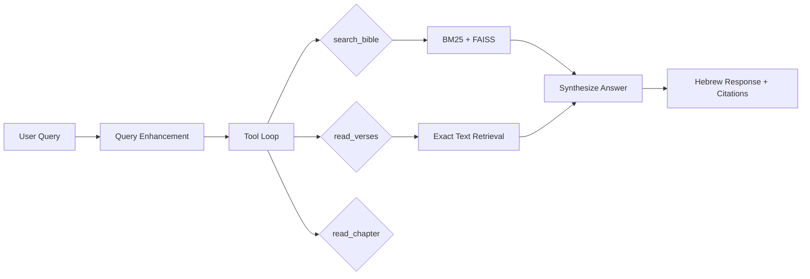

<div align="center">

# Bible QA Agent

A Hebrew Bible (Tanakh) Q&A agent that **searches locally** using BM25 + FAISS and answers **only from retrieved verses**, with footnote-style citations (Book/Chapter/Verse + **PDF page**).


---

[Features](#features) • [Installation](#installation) • [How It Works](#how-it-works) • [Examples](#conversation-examples)

</div>

---

## Features

| Feature                     | Description                                                           |
| --------------------------- | --------------------------------------------------------------------- |
| **Hybrid Retrieval**        | BM25 keyword + FAISS semantic search with reciprocal-rank fusion      |
| **Direct Verse References** | Queries like `"בראשית 12:2-4"` are detected and retrieved directly    |
| **Quote Integrity**         | Exact verse copying from `read_verses` tool output                    |
| **Transparent Logs**        | Full tool call traces in `responses.jsonl` and `search_results.jsonl` |
| **Conversation-Aware**      | Resolves Hebrew pronouns/references (e.g., "הוא" → "אברהם")           |
| **ReAct-Style**             | Structured tool loop for search → read → synthesize workflow          |


---

## Installation

### 1. Install Dependencies

```bash
pip install -r requirements.txt
```

### 2. Environment Setup

Copy `.env.example` to `.env` and add your OpenAI API key:

```bash
cp .env.example .env
```

### 3. Data & Index

Choose one of the following options:

**Option A: Use Pre-built Index**

The repository includes a pre-built index in `data/bible/index/` (built with `text-embedding-3-large`). You can start using the agent immediately:

```bash
# Interactive mode
python -m src.main

# Single question
python -m src.main -q "מי בנה את התיבה?"
```

**Option B: Build Your Own Index**

If you want to build the index from a Hebrew Bible PDF:

```bash
python scripts/setup_pdf_index.py path/to/hebrew_bible.pdf
```

This will create the following structure:

```
data/bible/
├── metadata.json
├── books/               # One JSON per book
└── index/
    ├── verses.json
    ├── chunks.json
    ├── index_meta.json
    └── index.faiss
```
---

## How It Works



1. **Query Enhancement** — Resolves pronouns and references using conversation context
2. **Tool Loop** — Iteratively searches and reads until sufficient context is gathered
3. **Synthesis** — Generates answer strictly from retrieved text with numbered footnotes

---

## Conversation Examples

Below are real conversation flows showing the agent's search and retrieval process.

---
<details>
<summary>סיפור נח</summary>

<div dir="rtl" align="right">

**שאלה: מי בנה את התיבה?**

</div>


<div dir="rtl" align="right">

**תשובה:**
התיבה נבנתה על ידי נח לפי ציווי ה'; ה' ציווה על נח לבנות את התיבה, ונח עשה ככל אשר צוה אותו אלהים[1][2].

---
[1] בראשית ו:יד-טז (עמוד 7)  
[2] בראשית ו:כב (עמוד 8)

</div>

---

<div dir="rtl" align="right">

**שאלה: למה?**

</div>


<div dir="rtl" align="right">

**תשובה:**
לפי הספר, ה' ציווה על נח לבנות את התיבה כדי להציל אותו ומשפחתו ובעלי־החיים מפני המבול שעתיד להשמיד את הארץ — מכיוון ש"הארץ... התמלאה חמס" ורעת האדם רבה[1]. כפי שנאמר: "וירא יהוה כי רבה רעת האדם בארץ וכל־יצר מחשבת לבו רק רע כל־היום"[1] ולכן "ויאמר אלהים לנח קץ כל־בשר... והנני משחיתם את־הארץ" — לכן נאמר לנח: "עשה לך תבת... וכפרת אתה מבית ומחוץ... והקמתי את־בריתי אתך"[2]. 

---
[1] בראשית ו:ה-ז, יא-יג (עמוד 7)  
[2] בראשית ו:יד-יח; בראשית ז:א-ה (עמוד 7-8)

</div>

---

<div dir="rtl" align="right">

**שאלה: מי נכנס?**

</div>

*Query enhanced to: " מי נכנס לתיבה?"*


<div dir="rtl" align="right">

**תשובה:**
אל התיבה נכנס נח; בניו — שם, חם ויפת — אשתו ונשי בניו; וכן בעלי־החיים — זוגות מכל־הבשר (ובמינים הטהורים שבעה-שבעה) כפי שה' צוה ונח עשה[1][2].

---
[1] בראשית ו:יז-כב (עמוד 7-8)  
[2] בראשית ז:א-ט,יג-טז (עמוד 8)

</div>

---

<div dir="rtl" align="right">

**שאלה: כמה זמן?**

</div>


<div dir="rtl" align="right">

**תשובה:**
על פי המקרא — נח ובניו ואנשי ביתו שהו בתיבה שנה ועשר ימים (מיום י"ז בחודש השני בשנת שש־מאות עד יום כ"ז בחודש השני בשנת שש־מאות ואחת)[1][2]. 

לפרטים נוספים על משך האירועים: הגשם ירד ארבעים יום וארבעים לילה, המים גברו ולפניו היו על הארץ חמשים ומאת יום, והתיבה נחה על הרי אררט וההרים נראו בשלבים עד ליבושה המלא[3].

---
[1] בראשית ז:יא-יג (עמוד 8)  
[2] בראשית ח:יג-יד (עמוד 9)  
[3] בראשית ז:יב,יז,כד; בראשית ח:ג-ה (עמוד 8-9)

</div>

---

<div dir="rtl" align="right">

**שאלה: ואז?**

</div>


<div dir="rtl" align="right">

**תשובה:**
לאחר שיצאו מן התיבה: הם יצאו לפי דבר ה' וכל־החיה יצאו למשפחותיהם והתחילו לשרוץ על־הארץ ולרבות[1]. נח בנה מזבח ועלה קרבן, וה' נשא בריח־הניחוח והבטיח שלא יקול על־האדמה עוד להכות כל־חי; ה' קבע סדר טבעי של עונות ויום ולילה[2]. אלהים ברך את־נח ובניו — "פרו ורבו ומלאו את־הארץ", נתן להם שליטה על־הבהמה ואפשר להם אכילת בשר עם איסור על דם, והקים ברית עם כל־החיה וסימנה הקשת בענן[2]. בהמשך נח נטע כרם, שתה יין ושכר; חם גילה את ערוות אביו, ושם ויפת כיסו את אביהם — על כך נחרה נח וקילל את כנען, וברך את שם ואת יפת[3].

---
[1] בראשית ח:יג-יט (עמוד 9-10)  
[2] בראשית ח:כ-כב; בראשית ט:א-יז (עמוד 10-11)  
[3] בראשית ט:כ-כז (עמוד 11)

</div>

---

<div dir="rtl" align="right">

**שאלה: מה הוא עשה כשיצא?**

</div>

*Query enhanced to: " מה נח עשה כשיצא?"*


<div dir="rtl" align="right">

**תשובה:**
כשיצאו מן התיבה — תחילה נח בנה מזבח והקריב עליו מן־הבהמה הטהורה ומן־העוף הטהור; ה' ריח את־ריח הניחח והבטיח שלא לקלל עוד את־האדמה ולא יהיה עוד מבול להשחית כל־בשר[1]. לאחר מכן ה' ברך את־נח ואת־בנים, ציווה עליהם "פרו ורבו" ונתן להם שליטה על החי, התיר אכילת בשר אך אסר אכילת דם והקים ברית עם נח וסימנה הקשת בענן[2]. בהמשך נח נטע כרם, שתה וחרש שכר; חם גלה את ערוות אביו, ושם ויפת כיסו — ונח קילל את כנען ובירך את שם ויפת[3].

---
[1] בראשית ח:כ-כב (עמוד 10)  
[2] בראשית ט:א-יג (עמוד 10-11)  
[3] בראשית ט:כ-כז (עמוד 11)

</div>

---

<div dir="rtl" align="right">

**שאלה: ומה אלוהים אמר?**

</div>


<div dir="rtl" align="right">

**תשובה:**
ה' אמר כמה דברים עיקריים לנח:

- אחרי הקטרת הקרבן: "וירח יהוה את־ריח הניחח ויאמר יהוה אל־לבו ךא־אסף לקלל עוד את־האדמה בעבור האדם כי יצר לב האדם רע מנעריו וךא־אסף עוד להכות את־כל־חי כאשר עשיתי"[1].

- ברכה והוראה למלא את הארץ: "ויברך אלהים את־נח ואת־בניו ויאמר להם פרו ורבו ומלאו את־הארץ"[2].

- מתן בעלי־החיים האדם והרשות לאכילתם עם איסור על הדם, ואחריות על דמם: "ומוראכם וחתכם יהיה על כל־חית הארץ... בידכם נתנו" ; "כל־רמש אשר הוא־חי לכם יהיה לאכלה..." ; "אל־בשר בנפשו דמו ךא תאכלו" ; "ו:

ואל את־דמכם לנפשתיכם אדרש... שפך דם האדם באדם דמו ישפך כי בצלם אלהים עשה את־האדם"[2].

- הקמת ברית שלא יהיה עוד מבול וסימנה — הקשת בענן: "ואני הנני מקים את־בריתי אתכם... והקמתי את־בריתי אתכם וךא־יכרת כל־בשר עוד ממי המבול וךא־יהיה עוד מבול לשחת הארץ" ; "את־קשתי נתתי בענן והיתה לאות ברית ביני ובין הארץ"[3].

---
[1] בראשית ח:כ-כב (עמוד 10)  
[2] בראשית ט:א-ו (עמוד 10)  
[3] בראשית ט:ח-יז (עמוד 10-11)

</div>

---

<div dir="rtl" align="right">

**שאלה: זאת הברית?**

</div>

*Query enhanced to: " זאת הברית שה' הקים עם נח?"*


<div dir="rtl" align="right">

**תשובה:**
כן. זאת הברית: ה' קבע ברית עם נח, עם זרעו ואית כל־נפש חיה; הבטיח שלא יהיה עוד מבול שישחית את כל־הבשר; ואת הקשת בענן נתן לאות הברית בין ה' ובין הארץ[1][2].

---
[1] בראשית ט:ח-יז (עמוד 10-11)  
[2] בראשית ו:יז-יח (עמוד 7)

</div>

---

<div dir="rtl" align="right">

**שאלה: מה הסימן?**

</div>

<div dir="rtl" align="right">

**תשובה:**
הסימן הוא הקשת בענן. כפי שנאמר: "את־קשתי נתתי בענן והיתה לאות ברית ביני ובין הארץ" ו"והיתה הקשת בענן וראיתיה לזכר ברית עולם בין אלהים ובין כל־נפש חיה בכל־בשר אשר על־הארץ"[1].

---
[1] בראשית ט:יב-יז (עמוד 10-11)

</div>
</details>

---

<details>
<summary>סיפור אברהם</summary>

<div dir="rtl" align="right">

**שאלה: מי זה אברהם? מה הסיפור שלו?**

</div>


<div dir="rtl" align="right">

**תשובה:**
אברהם (במקור אברם) הוא דמות מרכזית בספר בראשית: אבי עם ישראל ואדם שאליו ניתנו הבטחות אלוהיות על הארץ, על זרע רב ועל ברכה לעמי העולם[1][2].

קורות חייו העיקריים לפי התורה:
- מוצאו וביתו: בנו של תרח, יצא ממשפחתו בדרכו לחרן ונמנו בין צאצאי תרח[1].  
- הקריאה והברכה: ה' קרא לאברם לעזוב את מולדתו ולהלך לארץ שתראה לו; הובטחו לו ארץ, זרע רב וברכה לכל האומות[2].  
- מצרים ועימות עם שרי/שרה: בעת רעב ירד למצרים, ושם אירע המקרה שבו אמר שאשתו היא אחותו ופרעה לקח אותה עד שהתברר האמת[3].  
- פרידת הדרך עם לוט ותיקונו של השטח: אברם וחניכיו חיו בעושר; בגלל חילוקי מקום הוא והלוט נפרדו[4].  
- מלחמה והצלה: כשנשבו בני סדום ועמלק, אברם יצא להלחם והשיב את בניו ושאר הרכוש; פגש את מלכיזדק שנתן לו ברכה[5].  
- ברית עם ה' והבטחת זרע: ה' חיזק את הבטחתו לגבי זרעו, ואברם האמין בהבטחה זו[6].  
- הגר וישמעאל: שרה לא ילדה תחילה, ולכן הגר נתנה לו ילוד — ישמעאל; הדבר הוליד סכסוך מאוחר יותר[7].  
- ברית המילה ושינוי השמות: ה' כרת ברית עם אברם, ציווה על מילה, ושינה את שמו לאברהם (ושם שרה לשרה), והבטיח ששרה תלד את יצחק[8].  
- הולדת יצחק ותקריות עם סדום: שלוש באים שבאו לאברם ניבאו הולדת יצחק, ואברהם התפלל בעד אנשי סדום[9][10].  
- עקדת יצחק: ה' נבחן את אברהם וציווה עליו להעלות את יצחק לעולה; אברם כמעט הקריב את בנו אך נעצר על ידי מלאך והובא איל להקרבה במקום[11]. ההבטחות הושבו ואושרו שוב לאחר הניסיון[11].  
- מות שרה וקניית מערת המכשפה (מכרפלת): אברהם קנה כר סופית לקבורת שרה בארץ כקניין חוקי[12].  
- סוף ימיו: אברהם זקן ומלא ימים; מת ונקבר עם שרה במערת המכפלה[13].

לפרטים מדויקים של האירועים ניתן לעיין בפסוקים המפורטים בספר בראשית (מפרקים י"א–כ"ה)[1]–[13].

---
[1] בראשית 11:26-32  
[2] בראשית 12:1-9  
[3] בראשית 12:10-20  
[4] בראשית 13:1-13  
[5] בראשית 14:11-20, 14:17-20  
[6] בראשית 15:1-6  
[7] בראשית 16:1-16  
[8] בראשית 17:1-8, 17:15-22  
[9] בראשית 18:1-15, 18:16-33  
[10] בראשית 21:1-7, 21:9-21  
[11] בראשית 22:1-19  
[12] בראשית 23:1-20  
[13] בראשית 25:7-11

</div>

---

<div dir="rtl" align="right">

**שאלה: רגע, אז הוא התחיל בשם אחר?**

</div>

*Query enhanced to: " רגע, אז אברהם התחיל בשם אחר?"*


<div dir="rtl" align="right">

**תשובה:**
כן. בשמותיו הראשונים הוא נקרא "אברם"[1]. לאחר מכן, כאשר ה' דיבר אליו וברא עמו ברית בגיל תשעים ותשע, ה' שינה את שמו ל"אברהם" — "כי אב־המון גוים נתתיך"[2]. באותו מקטע גם שונה שמה של שרי ל"שרה"[2].

---
[1] בראשית יא:כו-לב; יב:ד-ה (עמוד 13-14)  
[2] בראשית יז:א-ה, טו-טז (עמוד 18-19)

</div>

---

<div dir="rtl" align="right">

**שאלה: למה השם השתנה? מה הרקע?**

</div>

*Query enhanced to: " למה השם של אברהם השתנה? מה הרקע?"*


<div dir="rtl" align="right">

**תשובה:**
כן. לפי התורה השם השתנה בשל ברית והבטחה אלוהית על עתידו ותפקידו:

- שם קודם: בתחילה הוא נקרא "אברם"[1].  
- המפגש שבו שונה שמו: כאשר היה בן תשעים ותשע ה' הופיע אליו וכרה עמו ברית והבטיח לו זרע רב; בהקשר זה נאמר במלים: "אני הנה בריתי אתך והיית לאב המון גוים"[2]. השינוי מציין את מעמדו החדש ומה שנותן לו ה' — להיות "אב המון גוים" (אב של רבים).  
- סימן הברית: הברית שהתנהלה יחד עם שינוי השם כוללת את מצוות המילה כ"אות ברית" בין ה' לאברהם ולזרעו[3].  
- גם שמה של שרה שונה באותו מעמד: ה' אמר לקרוא לה "שרה" והבטיח שגם ממנה ייצא זרע וברכה[4].

---
[1] בראשית יא:כו-כז (עמוד 13)  
[2] בראשית יז:א-ו (עמוד 18)  
[3] בראשית יז:ט-יד (עמוד 18)  
[4] בראשית יז:טו-יז (עמוד 19)

</div>

---

<div dir="rtl" align="right">

**שאלה: ואיפה כל זה קורה? הוא מסתובב הרבה**

</div>


<div dir="rtl" align="right">

**תשובה:**
קצר ולעניין — מסלול מסעותיו של אברהם לפי התורה (בסדר כרונולוגי עקרי):

- מוצא: יצא מאור כשדים והגיע לחרן עם משפחתו[1].  
- הקריאה וכניסה לארץ כנען: ה' קרא אליו לעזוב וללכת לארץ שנראתה לו; בא ארצה (שכם, אלון מורה) ובנה מזבחות; לאחר מכן נע צפונה-נגבה וביקר בבית־אל[2].  
- ירידה למצרים בזמן הרעב וחזרתו: ירד למצרים ולחזרתו שהה בנגב ובאזורי האוהלים[3].  
- ישיבה בחברון/אלני ממרא: אחרי הפרדתו מלוט ישב באלני ממרא (בחברון) ובנה שם מזבח[4].  
- מלחמות ורדיפות: יצא להלחם להשיב את לוט ורדף עד דן וממול לדמשק; פגש את מלכי־צדק ששלם לו ברכה[5].  
- ענייני הגר וישמעאל ובאר־לחי־ראי: סיפור הגר, מקום המלאך והבאר נקרא באר לחי ראי; מאוחר יותר הגר וישמעאל ישבו במדבר פארן[6].  
- ברית המילה ושינוי השם: ברית בין ה' לאברהם וכל פעולת המילה בוצעו בהקשר שה' קבע (שם אברם —> אברהם)[7].  
- גרר ואבימלך: שהה בין קדש ובין שור ויגר בגרר, שם אירע המפגש עם אבימלך[8].  
- הרי המוריה — עקידת יצחק: ה' ציווה עליו לעלות את יצחק בארץ המוריה (אתר ההתרחשות של המבחן)[9].  
- באר שבע, מכפלה וחברון — סוף החיים: לאחר ההתרחשות שב ובא לבאר שבע; קניית מערת המכפלה בחברון ושם נקבר הוא ושרה[10].

הערה קצרה: רוב האירועים מתרחשים בתוך תחום ארץ כנען ובאזורים השכנים (חרן, מצרים, דן/צפון, פארן—מדבר דרום), ולכן אכן אברהם "מסתובב הרבה" בין נקודות אלה[2][3][4].

---
[1] בראשית 11:31-32  
[2] בראשית 12:1-9  
[3] בראשית 12:10-20  
[4] בראשית 13:1-18  
[5] בראשית 14:13-20  
[6] בראשית 16:7-14; בראשית 21:14-21  
[7] בראשית 17:1-27  
[8] בראשית 20:1-18  
[9] בראשית 22:1-19  
[10] בראשית 23:1-20; בראשית 25:9-11

</div>

---

<div dir="rtl" align="right">

**שאלה: ההבטחה על הארץ - תראה לי את הניסוח המקורי**

</div>

*Query enhanced to: " מה ההבטחה על הארץ שקיבל אברהם? תראה לי את הניסוח המקורי."*


<div dir="rtl" align="right">

**תשובה:**
בקיצור: ההבטחה המרכזית היא שאלוהים מבטיח לאברהם (ולזרעו) את ארץ כנען — נוסחים ברורים מופיעים במספר מקומות. הנה הניסוחים המקוריים כפי שהם בתורה:

ציטוטים מהטקסט:
- "וירא יהוה אל־אברם ויאמר לזרעך אתן את־הארץ הזאת ויבן שם מזבח ליהוה הנראה אליו"[1]

- "כי את־כל־הארץ אשר־אתה ראה לך אתננה ולזרעך עד־עולם"[1]

- "ויהי השמש באה ועלטה היה והנה תנור עשן ולפיד אש אשר עבר בין הגזרים האלה  
  ביום ההוא כרת יהוה את־אברם ברית לאמר לזרעך נתתי את־הארץ הזאת מנהר מצרים עד־הנהר הגדל נהר־פרת  
  את־הקיני ואת־הקנזי ואת הקדמני  
  ואת־החתי ואת־הפרזי ואת־הרפאים  
  ואת־האמרי ואת־הכנעני ואת־הגרגשי ואת־היבוסי"[2]

- "ונתתי לך ולזרעך אחריך את ׀ ארץ מגריך את כל־ארץ כנען לאחזת עולם והייתי להם לאלהים"[3]

הסבר קצר: בפסוקים הראשונים (בראשית י"ב, י"ג) ההבטחה מבוטאת באופן כללי — "אתן את הארץ הזאת" ו"אתננה ... ולזרעך עד עולם". בפסוע העיקרי של הברית (בראשית ט״ו) הנוסח מפרט גבולות גאוגרפיים: "מן־נהר מצרים עד־הנהר ... פרת" ופורש רשימת עמי הארץ. בפסוק נוסף (בראשית י"ז) הנוסח חוזר ומנסח את ההבטחה כ"נתתי לך ולזרעך ... את כל־ארץ כנען לאחזת עולם". אלה הם הנוסחים התנ"כיים המרכזיים של הבטחת הארץ לאברהם ולזרעו.

---
[1] בראשית י״ב:ז; י״ג:יד-יז (עמודים 14-15)  
[2] בראשית ט״ו:יז-כא (עמוד 17)  
[3] בראשית י״ז:ח (עמוד 18)

</div>

---

<div dir="rtl" align="right">

**שאלה: יש עוד מישהו שמקבל הבטחה דומה?**

</div>

*Query enhanced to: " יש עוד מישהו שמקבל הבטחה דומה להבטחה שקיבל אברהם?"*


<div dir="rtl" align="right">

**תשובה:**
כן. התורה חוזרת ומעניקה הבטחה דומה (הבטחת הארץ) גם לבניו של אברהם ובכלל לעם ישראל:

- ליצחק — ה' אומר ליצחק ש"לך ולזרעך אתן את־כל־הארץ" ומאשר את הברית שנשבעת לאברהם[1].  
- ליעקב — ה' מופיע ליעקב ואומר "הארץ אשר אתה שכב עליה לך אתננה ולזרעך", ובהמשך מבטיח שוב שהארץ שניתנה לאברהם וליצחק תינתן לו ולזרעו[2].  
- לעם ישראל (דרך משה) — ה' מצטט את בריתו עם אברהם, מודיע על כוונתו להביא את בני ישראל אל־הארץ שנשבע לתת לאבותיהם[3].  
- בנבואה אחרית הימים — נחמה והבטחה שישראל ישבו בארץ ויהיה להם ברית־שלום, כפי שאמר ה' בנבואת יחזקאל[4].

כלומר — ההבטחה לאברהם חוזרת ומועברת ליצחק וליעקב ולצאצאיהם, וגם מופיעה כחלק מהדגם הבריתי־לאומי בתורה ובנבואות.

---
[1] בראשית כו:ג-ד, כו:כד-כה (עמוד 31)  
[2] בראשית כח:יג-טו; בראשית של:יא-יב (עמוד 35, 46)  
[3] שמות ו:ד-ח (עמוד 75)  
[4] יחזקאל לח:כה-כח (עמוד 612)

</div>

</details>

---

<details>
<summary>קהלת and cross reference</summary>

<div dir="rtl" align="right">

**שאלה: מי זה קהלת? מה הקטע שלו?**

</div>


<div dir="rtl" align="right">

**תשובה:**
קהלת — כפי שהספר מציג אותו — הוא המספר שמזהה את עצמו במפורש: "דברי קהלת בן־דוד מלך בירושל ם" וכשלעצמו הוא אומר גם "אני קהלת הייתי מלך על־ישראל בירושל ם"[1].

מה הקטע שלו?
- המוטו החוזר של הספר הוא "הבל הבלים" — תמה של שבריריות וחוסר־קיום משמעותי של מעשים וחשדות האדם: "הבל הבלים אמר קהלת הבל הבלים הכל הבל"[2].
- קהלת מברר וניסויי דרכים שונות למציאת טעם: חיפש בשמחה, ביין ובתענוגות; בנה בתים, צבר נכסים; חקר חכמה וסכלות — ובסופו של דבר מציין שהכול רעות רוח והבל[3].
- הוא גם מתאר את חוקיות הזמן והמעגליות של החיים ("לכל זמן ועת...") ומעלה שאלות על תכלית העמל האנושי[4].
- הסיכום המעשי של הספר אינו רעיון פילוסופי מורכב אלא עצה רוחנית פשוטה: "סוף דבר הכל נשמע את־האלהים ירא ואת־מצותיו שמור כי־זה כל־האדם" — כלומר יראת ה' ושמירת מצוות הן המסקנה[5].

---
[1] קהלת א:א; א:יב (עמוד 897)  
[2] קהלת א:ב; א:יד; ב:יא; יב:ח (עמודים 897, 898, 906)  
[3] קהלת ב:א-יח (עמודים 897-898)  
[4] קהלת ג:א-י (עמוד 899)  
[5] קהלת יב:ז-יד (עמודים 906-907)

</div>

---

<div dir="rtl" align="right">

**שאלה: שלמה אמר משהו אחר על חכמה במקום אחר?**

</div>


<div dir="rtl" align="right">

**תשובה:**
כן. בספר משלי, המסורת מייחסת לחכמה משמעות חיובית ומשמעתית ושמה את יראת ה' כראשיתה. למשל: "יראת יהוה ראשית דעת חכמה ומוסר אוילים בזו"[1]—ו"תחלת חכמה יראת יהוה ודעת קדשים בינה"[2]. משלי מדגיש שחכמה יקרה מגנזי־עול, כי "אשרי אדם מצא חכמה ואדם יפיק תבונה" ו"כי־טובה חכמה מפנינים וכל־חפציך ךא ישוו־בה"[3]. בספר זה החכמה מופיעה גם כדמות מדברת (מייצגת עצה, תושיה וגבורה) המזמינה ללמוד ולשמוע[4].

לכן, בעוד שקהלת מדגיש את הבלות וקשיי מציאת תכלית, משלי (המיוחס לשלמה) מציג גישה אחרת: חכמה כערך מרכזי שמתחיל ביראת ה' ומביאה לקדושה, חיים ותועלת מעשית[1][2][3][4].

---
[1] משלי א:ז (עמוד 806)  
[2] משלי ט:י (עמוד 815)  
[3] משלי ג:יג-טו (עמוד 808)  
[4] משלי ח:י-טו (עמודים 813-814)

</div>

---

<div dir="rtl" align="right">

**שאלה: ומה איוב אומר על חכמה? הוא גם מתייחס?**

</div>

*Query enhanced to: " מה איוב אומר על חכמה? האם איוב גם מתייחס?"*


<div dir="rtl" align="right">

**תשובה:**
כן — בספר איוב יש התייחסות מובהקת לחכמה, והעיון בה שונה במקצת ממשלי וקהלת.

מה איוב אומר:
- בפרק 28 יש שיר־מהרהר על החכמה: האדם יודע לחצוב מתכות ולמצוא אבנים יקרות, אבל "והחכמה מאין תמצא ואי זה מקום בינה"[1]. השיר מסתיים בהכרזה שהחכמה איננה בבעלות אנושית אלא נתונה אלוהים: "ויאמר ׀ לאדם הן יראת אדני היא חכמה וסור מרע בינה"[1].  
  (הרעיון המרכזי: החכמה נסתרת מעיני האדם ומקורה ביד האל.)

- גם בדברי אליהו (או המדבר הצעיר, אליהו/אליהו בן־ברכאל — נאום פרקים 32–34) יש התייחסות לחכמה ולמנין שלה: רוח־האל מלהיבה ומעניקה תבונה לאדם — "אכן רוח־היא באנוש ונשמת שדי תבינם"[2] — והוא קורא לאיוב להקשיב: "אם־אין אתה שמע־לי החרש ואאלפך חכמה"[2]. נאומיו של המדבר גם טוענים שיש לשמוע את אנשי־לבב וחכמים בשיח על הדין[2].

מסקנה קצרה: בספר איוב החכמה מוצגת כמשהו שאי־אפשר למדוד או לרכוש באמצעים אנושיים; היא נתונה בידי האל, ותכליתה מוסרית־דתי מתמצה ב"יראת ה'". כלומר — כן, איוב (בצורתו השירית ובדברי המדבר) מתייחס בחשיבות רבה לחכמה, אך מדגיש את גבולות היכולת האנושית להחזיקה ולגלותה.[1][2]

---
[1] איוב כח:א-כח — בעיקר: "והחכמה מאין תמצא ואי זה מקום בינה" ; "ויאמר ׀ לאדם הן יראת אדני היא חכמה וסור מרע בינה" (עמוד 864-865)  
[2] איוב לב:ז-טו; לג:ל-לא; לד:לא-לה — למשל: "אכן רוח־היא באנוש ונשמת שדי תבינם" ; "אם־אין אתה שמע־לי החרש ואאלפך חכמה" ; "בעלי לבב יאמרו לי וגבר חכם שמע לי" (עמודים 868-871)

</div>

</details>

---

<details>
<summary>צבא ותנ״ך</summary>

<div dir="rtl" align="right">

**שאלה:  לפי הספר, האם כדאי להתגייס לצבא?**

</div>


<div dir="rtl" align="right">

**תשובה:**
קצר ותכליתי: בתנ"ך גיוס לצבא מוצג כעניין מקובל ואף מוכתב בזמני מלחמה, אך יש גם פטורים והנחיות ברורות — כלומר, "כדאי" על פי הספר תלוי בנסיבות ולא נתון כהוראת חובה אחידה לכל אדם בכל מצב[1][2][3].

נקודות עיקריות מהטקסט:
- מיהם הנדרשים לצאת לצבא: "מבן עשרים שנה ומעלה כל־יצא צבא בישראל תפקדו אתם לצבאתם" — כלומר מונים גברים מבוגרים למלחמה[1].  
- דוגמאות למקרים של שליחת אנשים לצבא (נקמה/מבצעי־מלחמה): תלמידים נשלחו לנקום את בני ישראל במדין[2].  
- עידוד ביטחון ואמונה בבוא למלחמה: "כי־תצא למלחמה על־איבך ... ךא תירא מהם כי־יהוה אלהיך עמך" — יש דגש שה' הולך עם העם במלחמה[3].  
- פטורים והקלות לפני המלחמה: נפטרים מהשירות מי שבנה בית חדש, נטע כרם, אירש אישה — וכן מי שהירא לבבבו; השטרים מודיעים על כך[3].  
- כללים להתנהלות במצור ומלחמה (קריאת שלום לעיר, מה עושים אם לא מסכימים וכו')[3].  
- חשיבות תכנון וייעוץ בעת מלחמה: "כי בתחבלות תעשה־לך מלחמה ותשועה ברב יועץ"[4].  
- תמונת יסוד רוחנית: "יהוה איש מלחמה יהוה שמו" — תמיכה ברעיון שה' הוא הלוחם של העם[5].

מסקנה מעשית לפי הטקסט: אם מדינת/עם ישראל יוצא למלחמה או נאבק בעוולה, התנ"ך מציג גיוס כפעולה ראויה ורצויה עבור הגברים שנמנו; יחד עם זאת יש פטורים והנחיות ברורות ומודגשת חשיבות הייעוץ והביטחון באל. המשחק ההחלטי האם "כדאי" עבור אדם מודרני להתגייס אינו מנוסח כתשובה אוניברסלית במקרא — התנ"ך נותן כללים וערכים שעל פיהם יש לשקול את ההחלטה[1][2][3][4][5].

---
[1] במדבר א:א-ג, א:לג-לד (עמוד 164-166)  
[2] במדבר לא:א-ו (עמוד 212)  
[3] דברים כ:א-ט, י-טו (עמוד 249)  
[4] משלי כד:ו (עמוד 831)  
[5] שמות טו:ג (עמוד 88)

</div>

</details>

---

## 📁 Project Structure

```
bible_qa_agent/
├── agent.py          # BibleAgent - orchestration + conversation state
├── generator.py      # ResponseGenerator - ReAct loop, citations, logging
├── search.py         # BibleSearch - BM25/FAISS/hybrid search
├── main.py           # CLI - interactive shell + logging
└── build_index.py    # Index builder - chunks, embeddings, FAISS
```

| Component               | Description                                                     |
| ----------------------- | --------------------------------------------------------------- |
| **`BibleAgent`**        | Exposes `query()`/`chat()` and direct tool methods              |
| **`ResponseGenerator`** | Handles ReAct tool loop, citation formatting, query enhancement |
| **`BibleSearch`**       | Loads indices, runs searches, supports verse-range expansion    |
